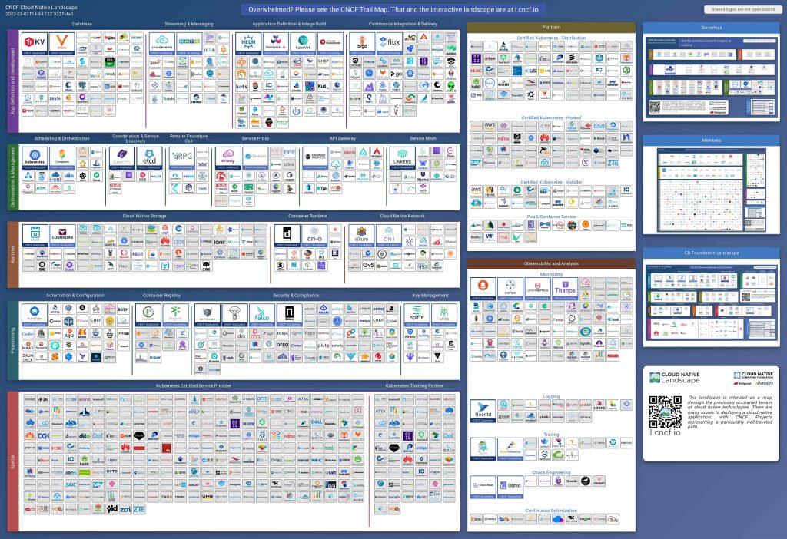

The Heighliner Stack provides an easy way to build complex cloud-native applications.
It makes sure cloud native applications are developed and deployed with best practices.

## Complexity of building cloud-native applications

The complexity of application architecture multiplies as the business grows. Support you begin with building a simple personal blog hosted on cloud. What platform and tech stack would you choose? The answer might be Heroku, WordPress, Netlify, or even GitHub pages. They are simple, cheap, and reliable enough for simple applications such as personal blogs. In this case, no one cares about micro-service, containers, Kubernetes, Autoscaling, GitOps, so on and so forth.

Nonetheless, modern enterprises, such as e-commerce and/or social platforms, have employed thousands of developers to build software in a monolithic application. As the number of developers grows, so does the complexity of building such an application. The micro-service architecture supports separating concerns of different teams and better cooperation. As a result, micro-service architecture gets more and more popular.

To support such micro-service trends, cloud native technologies has been born to satisfy modern application architecture. Developers want their applications to be highly available and fault-tolerant. But the number of applications gets 100x bigger so they can't be managed and operated in the old way. Therefore, concepts such as elastic scaling, distributed monitoring, and deployment strategies have emerged to solve such problems.

Developers want their applications to be highly available and fault-tolerant. But micro-service pattern will increase the number of applications to 100x bigger. This will make it hard if not impossible to manage or operate. To support the micro-service trend, cloud native technologies has been born to satisfy modern requirements. Concepts such as service mesh, distributed tracing, continuous profling has emerged. Developers has been given the power to easily build CI/CD pipelines, elastic scaling solutions, observability stacks, canary deployment strategies, etc.

With great power comes great responsibility. Now the developers realize they spend more time dealing with infrastructure than buisness code. Soon they realize this is wrong -- they need to focus on buisness logic that generates revenue! This is a new problem that developers face in the cloud native journey.

## Configuration! Configuration! Configuration!

The sheer number of tooling in cloud native community is growing fast. Soon developers are overwhelmed by the configuration work.

Here is the Cloud Native Landsacpe of CNCF (https://l.cncf.io/)

Turning this picture into a production toolchain requires thousands of lines of configuration. Terraform provides a good way to organize the infrastructure. Kubernetes provides a good way to organize the deployment architeture. But there is still no good way to organize the development process and delivery workflow.

Consider the following questions:

- Should the source code and the Kubernetes Manifests be in the same Git repository?
- What is the mapping relationship between branches and  environments?
- What namespace monitoring metrics should Prometheus capture?
- What dashboard and graph should Golang developers focus on?
- What alert rules should be configured?
- Should I use a self-built open source product or a commercial product?
- How to remote debug container in Kubernetes cluster?

Everyone wants to know the industry standards to make their decisions. Thus we need well-defined cloud-native best practices as a collection of all proven and reliable methods.

## Preconfigured Best Practices

We build these best practices into a project called Heighliner. Starting from developer-centric mind, we provides many pre-configured stacks covering popular programming languages and frameworks. For example, go-gin-stack is a toolchain preconfigured with the following tools and techniques:

- Golang
- Git Repository(Currently provided by GitHub)
- Gin Framework
- Swagger
- Vue.js
- Gorm
- Docker
- CI pipeline(Currently provided by GitHub Actions)
- ArgoCD
- Mariadb
- Redis
- NATS
- Helm
- Kubernetes
- Nocalhost
- Prometheus
- Grafana
- Istio
- Jaeger
- Loki

A toolchain composed of the above tools will support business development based on Golang. Preconfigured delivery flow speeds the DevOps process up.
Pre-configured observation capabilities covering logs, metrics and distributed tracing.
Database and messaging middleware ensures applications can handle stateful and asynchronous tasks with ease.
GitOps based on ArgoCD and helm makes application publishing simple and efficient.

此处插入 GIF 动画

Based on a stack like this, developers can spin a cloud-navite application up in minutes without the complexcity of configuration. Stack is open source and transparent, which ensures that developers have no barriers to understand all the process of code from editing to deployment.

With this convention-over-configuration mindset, developers can enjoy the coding-testing-commiting inner development loop.

## What's next?

A developer console can be built to display key states in delivery flow, such as build results, deployment versions, logs, traffic control rules, alerts etc.
Developers can get any useful information in that console and can manipulate the application the way they want.