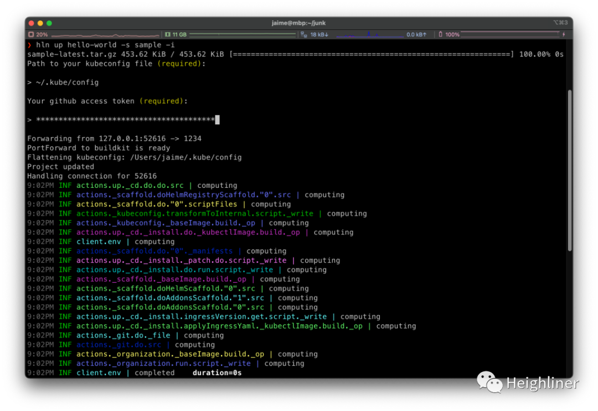

## The Cloud Trends

Today the cloud takes us to a new era:
With an increasing number of cloud infrastructure services, a dedicated team of developers can ship a compelling product in almost any industry within weeks.
The cloud has become something like water and electricity for the entire human society.
We have witnessed the rapid growth of the cloud especially when COVID hit the world.

Along with it comes the fast-growing cloud native community.
Cloud native technologies are changing the way developers use cloud services via open standards.
In this way, developers can build their apps across clouds without locking into specific vendors.
Since Kubernetes donation as the first project, CNCF (Cloud Native Computing Foundation) has been cradling and growing hundreds of projects as a neutral foundation.
It is still evolving fast and providing developers with more standard interfaces to use the cloud.
By now, cloud native means not only adopting Kubernetes, but also building best practices for the entire software development lifecycle.
Here we are listing some of the latest trends:

- **DevSecOps**:
    It continues to be the primary focus of IT management and software engineering teams to secure the cloud infrastructure.
    As software supply chain grows and privacy policies improves, there will be security and conformance validation in every step of software delivery and maintenance.
- **Remote Development**:
    Developers are often limited by the hardware resources of local laptops, inconsistency between development and production environments, and complication of microservice dependencies.
    Nonetheless, projects like [Nocalhost](https://nocalhost.dev) are trying to move development activities onto the cloud.
    All developers need is an IDE and they can even collaborate on the same environment.
- **Observability**:
    As [OpenTelemetry](https://opentelemetry.io) becomes more and more popular, the format to collect logs and metrics becomes more standardized.
    This has improved the development of digital transparency of cloud apps.
    Meanwhile, uprising [continuous profiling](https://www.parca.dev) projects are making it easier to do problem debugging and performance analysis.
    It takes them to a new level that you can see what happened simultaneously.
    Moreover, the rise of [ePBF adoption in observability](https://pixielabs.ai) makes it possible to observe with no instrumentation, which frees
    developers and improve their efficiency.
- **GitOps**:
    CI/CD gradually becomes the primary topic as the concepts of cloud native gets widespread.
    GitOps, as a new pattern for continuous delivery from the cloud native community, is trying to codify into Git
    all the infrastructure dependencies of your app in a declarative format.
    By doing so developers will get better version control and access management for their application infrastructure.
    Recently, the founders of ArgoCD project has created a startup ([akuity.io](https://akuity.io)) for commercializing ArgoCD.
    This reflects the growing demand for GitOps and confidence from the capital markets.

## Are Developers Satisfied?

Even though having so many choices from the cloud native community, developers still have complex feelings:

- On the one hand, they like these choices and to use them in production.
  In this way they can build best practices based on open standards, and have a future-proof application architecture.
- On the other hand, they are scared and overwhelmed by the complexities of open source projects.
  It is very complicated and difficult to setup these projects from end to end.
  Moreover, the iteration speed of these projects is very high. Developers don't have enough time and energy to keep up with.

## Heighliner Born For Developers

Developers' time are precious.
If they can't focus themselves on developing applications but waste too much time on getting infrastructure tools to work,
it will eventually incur huge cost to both developers and enterprises.

Today we build a developer tool called **Heighliner** to solve the above problem.
It is a modern developer tool that can deliver your **application stack as code**.
You can codify low level details into human-readable configuration files that you can version, reuse, and share.
We try to tell developers via Heighliner that "Your application stack can be managed just like your application code. You deserve a better user experience."
We say that because Heighliner is:

- **Developer-centric**:
    Heighliner defines the entire application stack from a developer-centric perspective, including
    code repositories, app frameworks, CI/CD pipelines, Helm Charts, monitoring dashboards, alerting rules, remote development config, and so on.
- **Versatile**:
    We provide official stacks for popular languages and frameworks. Users can choose one of these stacks to spin up cloud native development environments in one click.
    The languages and frameworks include Go, Spring, Next.js, Vue.js, Remix, etc.
- **Customizable**:
    Users can customize every single step of any stack.
    We are glad that Docker creator Solomon has created [Dagger](https://dagger.io/).
    Dagger significantly simplify our user experience to develop Heighliner stacks.
    We support using Dagger to customize any stack.
    Besides Dagger libraries, we provide additional libraries targeted for cloud native technologies.

With above benefits from Heighliner, developers can take advantage of the evolution of cloud native technologies.
The latest technological updates will be consumed in a way that developers are familiar with -- using code.
In this way developers can continuously evolve their application architecture.

## Getting Hands-on

In the following we will demonstrate how to spin up an entire cloud native development environment within 2 minutes.

**Step 1**: Install Heighliner tool

```shell
$ curl -L https://dl.h8r.io/hln/install.sh | sh
```

**Step 2**: Prepare a Kubernetes cluster

```shell
$ kubectl version
Client Version: version.Info{Major:"1", Minor:"24", GitVersion:"v1.24.0", GitCommit:"4ce5a8954017644c5420bae81d72b09b735c21f0", GitTreeState:"clean", BuildDate:"2022-05-03T13:46:05Z", GoVersion:"go1.18.1", Compiler:"gc", Platform:"darwin/arm64"}
Kustomize Version: v4.5.4
Server Version: version.Info{Major:"1", Minor:"23", GitVersion:"v1.23.5", GitCommit:"c285e781331a3785a7f436042c65c5641ce8a9e9", GitTreeState:"clean", BuildDate:"2022-03-24T22:10:16Z", GoVersion:"go1.17.8", Compiler:"gc", Platform:"linux/arm64"}
```

**Step 3**: Create your development environment in one command

```shell
$ hln up hello-world -s sample -i
```



Eventually Heighliner will build and deploy your application:


Heighliner will create automatically for you the Github repositories, Helm Chart, CI/CD pipelines, DNS domain routing, ArgoCD apps, Grafana dashboards, Nocalhost DevSpace, etc.


## Embrace Community

By now, Heighliner has provided many out-of-box features that you can play with. You can learn more at [heighliner.dev](https://heighliner.dev).

In the mean time, we believe in the long term value that open source community will bring us.
All projects of Heighliner including official stacks are open source Apache-licensed.
Moreover, we are contributing to open source projects like Dagger, Nocalhost, etc.
It is our ambition to build an open community that benefits every developer in the future.

Heighliner is still in the early stages of development. To grow and prosper it needs badly one important factor -- you as the passionate developer.
If you are interested in Heighliner, Dagger, Nocalhost, or any other cloud native projects,
you are welcome to:

- join our [Discord channel](https://discord.gg/WphTbdVHFA)
- contact us via [community channels](https://heighliner.dev/contact-us).
- provide us feedback at [heighliner github issues](https://github.com/h8r-dev/heighliner/issues)
