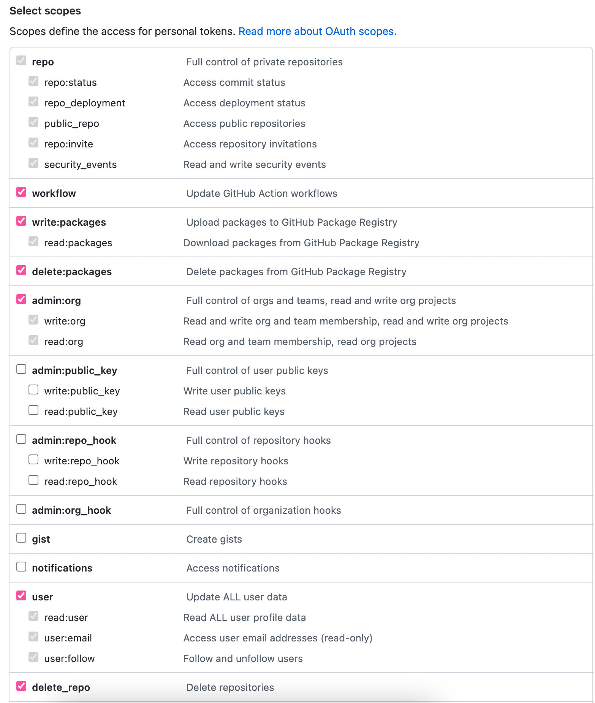

## 1. Install `hln` CLI

import Tabs from '@theme/Tabs';
import TabItem from '@theme/TabItem';

<Tabs>
  <TabItem value="macos" label="MacOS" default>

Homebrew:

```bash
brew install h8r-dev/tap/heighliner
hln version
```

Or use the install script:

```bash
curl -L https://dl.h8r.io/hln/install.sh | sh
./bin/hln version
```

Or download binaries: [Github Release](https://github.com/h8r-dev/heighliner/releases)

  </TabItem>
  <TabItem value="linux" label="Linux">

Use the install script:

```bash
curl -L https://dl.h8r.io/hln/install.sh | sh
./bin/hln version
```

Or download binaries: [Github Release](https://github.com/h8r-dev/heighliner/releases)

  </TabItem>
  <TabItem value="windows" label="Windows">

Download binaries: [Github Release](https://github.com/h8r-dev/heighliner/releases)

  </TabItem>
</Tabs>

## 2. Install Kubernetes Cluster

Install `kubectl` command-line tool first by following the [instructions](https://kubernetes.io/docs/tasks/tools/).

Then choose one of the following methods to install a Kubernetes cluster:

<Tabs
className="unique-tabs"
defaultValue="kind"
values={[
{label: 'Kind', value: 'kind'},
{label: 'Minikube', value: 'minikube'},
{label: 'AWS', value: 'aws'},
{label: 'Azure', value: 'azure'},
{label: 'Alibaba', value: 'aliyun'},
{label: 'Tencent', value: 'tencent'},
]}>

<TabItem value="kind">

Follow [kind installation guide](https://kind.sigs.k8s.io/docs/user/quick-start/#installation) to install `kind` command-line tool.

Then spins up a kind cluster:

```shell
cat <<EOF | kind create cluster --image=kindest/node:v1.23.5 --config=-
kind: Cluster
apiVersion: kind.x-k8s.io/v1alpha4
nodes:
- role: control-plane
  kubeadmConfigPatches:
  - |
    kind: InitConfiguration
    nodeRegistration:
      kubeletExtraArgs:
        node-labels: "ingress-ready=true"
  extraPortMappings:
  - containerPort: 80
    hostPort: 80
    protocol: TCP
  - containerPort: 443
    hostPort: 443
    protocol: TCP
EOF
```

Install ingress controller to enable ingress routing:

```shell
kubectl apply -f https://raw.githubusercontent.com/kubernetes/ingress-nginx/master/deploy/static/provider/kind/deploy.yaml
```

</TabItem>

<TabItem value="minikube">

Follow the minikube [installation guide](https://minikube.sigs.k8s.io/docs/start/).

Then spins up a minikube cluster

```shell
minikube start
```

Install ingress controller to enable ingress routing:

```shell
minikube addons enable ingress
```

</TabItem>

<TabItem value="aws">
</TabItem>
<TabItem value="azure">
</TabItem>
<TabItem value="aliyun">
</TabItem>
<TabItem value="tencent">
</TabItem>

</Tabs>

Finally, set this environment variable:

```shell
export KUBECONFIG="$HOME/.kube/config"
```

## 3. Install Dagger CLI

Follow [Dagger documentation](https://docs.dagger.io/1200/local-dev) to install `dagger` command-line tool.

## 4. Create Github Token

Create a [GitHub personal access token](https://docs.github.com/en/authentication/keeping-your-account-and-data-secure/creating-a-personal-access-token) with the following scopes selected:

- `repo`
- `workflow`
- `write:packages`
- `delete:packages`
- `admin:org`
- `user`
- `delete_repo`


